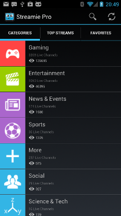

# 

Source code for Streamie, an Android stream aggregator (Justin.tv and Twitch.tv)

## Streamie Background
This project was a pet project of mine that I worked on as an undergraduate at Brigham Young University. It became a very popular alternative to the official Justin.tv and Twitch.tv Android apps between 2013 and 2014, with nearly 500,000 downloads and a high retention rate. 

It is not currently on the Play store because after I graduated my real job took priority - since I could not keep the quality of the product high, I decided to unpublish it. The native apps have, of course, improved and it is impossible to compete with the native apps since they have private API access. 

I decided to release the source code for this app to help other developers see how a complex Android app might look. This was the second app I ever wrote, and was an excellent project to learn how to code in Java and Android specifically. I used some moderately advanced techniques in this release and worked with two separate APIs. 

Feel free to go through the source code and learn from the good and the bad. If you use parts of this code, please just give me attribution. 

## APK Releases
These are posted for historical purposes and will not run properly if sideloaded because the API keys are no longer valid. Even if the keys were valid, the APIs Streamie uses have been deprecated so is unlikely to work properly. 

* [Streamie Pro 3.0](release/Streamie-pro-release.apk)
* [Streamie Free 3.0](release/Streamie-free-release.apk)

## Screenshots
|||
|---|---|
| *Category Listing*| *Category Listing Dark*|
| *Channel Listing*| *Channel Detail*|

 *Chat Left*

 *Chat Right*

## Application Details
### Libraries Used
* Amazon Ads
* Google AdMob
* Jerklib
* Lombok

### Original Google Play Description:
> If you aren't 100% satisfied with the app and it's been over 15 minutes, contact us within 24 hours and we'll issue you a full refund. Big update! Thanks for your patience while we release Streamie 3.0
> 
> Streamie Free is an unofficial app that allows you watch all of your favorite Justin.tv AND Twitch.tv streams on your Android device.
> 
> Streamie features:
> 
> * Stream all Justin.tv channels
> * Stream all Twitch games
> * Search through Justin.tv and Twitch
> * Connect to your Twitch account to add and remove favorites. Twitch.tv support is coming soon
> * Chat overlay: chat while you watch the stream. Swipe left or right to move the chat window or back to hide it
> * Clean, intuitive interface: easily search or browse to find great content
> * Filter mature streams
> 
> 
> FLASH IS REQUIRED. Streamie will help you install flash if you don't have it already.
> NOTE: Due to design changes by Google, some new phones and tablets will not play flash in a webview. We are actively working on a solution for this.
> 
> Please rate Streamie 4 or 5 stars if you feel we deserve it. If not, please contact us and tell us how we can do better. 
> If you have any bugs please contact us directly so that we can quickly support you.
> 
> Currently only Justin.tv and Twitch streams are available. We are working hard to add other video services to Streamie.
> 
> 
> KNOWN ISSUES: 
> * If you have an ad blocker on your phone, it can take a long time to load the stream. This is because the ad request needs to time out.
> 
> Terms of Service:
> 
> Justin.tv allows this content to be available: 
> 
> "Who can use [our video streams]? Everyone. That's why we're releasing this API so that anyone can customize Justin.tv to work exactly the way they want it to." http://www.justin.tv/p/api
> 
> According to the Justin.tv terms of service, anyone with access to these streams gets "a perpetual, personal, non-commercial, non-transferable, non-exclusive license to access and view [...] Lifecaster Content." http://www.justin.tv/p/terms_of_service

*Bonus: [Google Play Ratings Drama](https://www.reddit.com/r/Android/comments/1665en/my_app_is_getting_1star_ratings_from_another_dev/)*

## Credits
This is solely the work of its author, [Bradford Law](bradford.la). 

## [License: MIT](LICENSE)

